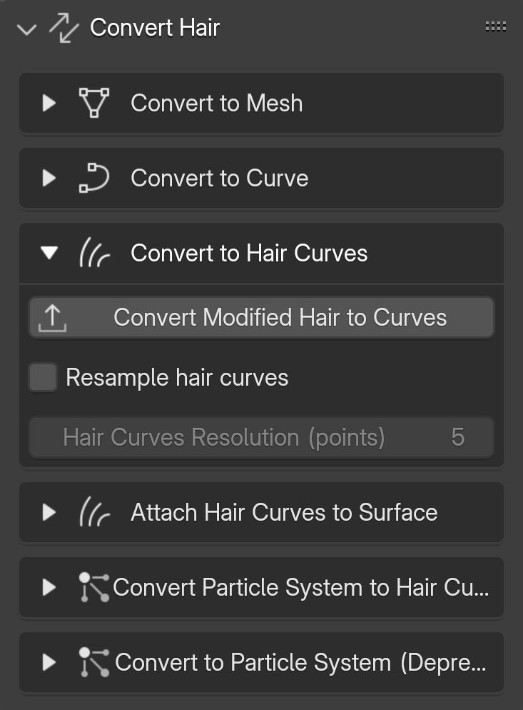

# Convert Hair

## UI

{.responsive-img}

---

## To mesh

Suitable for converting stylized or card-based hair into a mesh object for export to other software, such as game engines.

{.responsive-img}

---

## To curve

Suitable for converting groomed hair curves into curve objects, providing more control over the tilt and scale of the curves when creating stylized or card-based hair.

**Controls:**

- Curve Points: Number of segments each curve will have after conversion.

{.responsive-img}

---

## To hair curves

Suitable for converting curve objects into hair curves or applying all hair curve modifiers to create a new object.

{.responsive-img}

---

## Attach hair curves to surface

Suitable for attaching hair curve objects to a mesh object by selecting the mesh object and its UV map.

{.responsive-img}

---

## Particle systems to hair curves

Suitable for converting hair particle systems into hair curves.

{.responsive-img}

---

## To particle system(deprecated)

Not recommended for use, as it will be replaced by Blender's new hair system in the future.

!!! tip
    This feature only converts the active hair curve object in the viewport, so make sure to select the hair object first.

{.responsive-img}

**Options:**

- Parent Object: The object to which the hair will be added as a particle system.
- Parent's UV Map: The UV map of the parent object.

{.responsive-img}

---