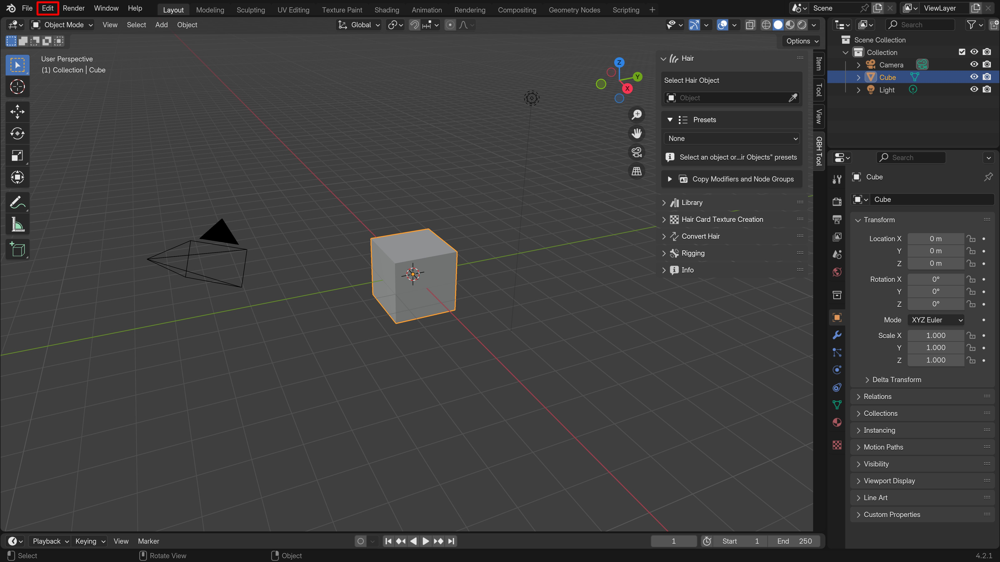

# Installation

- Open Blender and click "Edit" in the top bar.

- In the "Edit" menu, click "Preferences".

- In "Preferences", go to the "Get Extensions" section. From the drop-down menu, select "Install from Disk".

- Locate and select the downloaded .zip file.

- The add-on's name will appear as shown below.

---