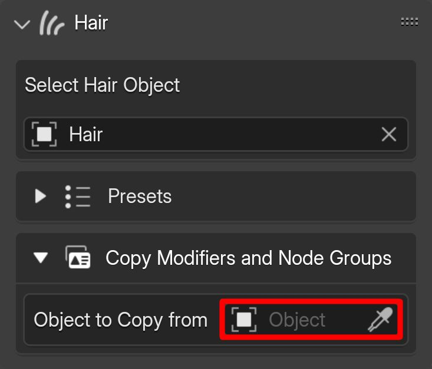
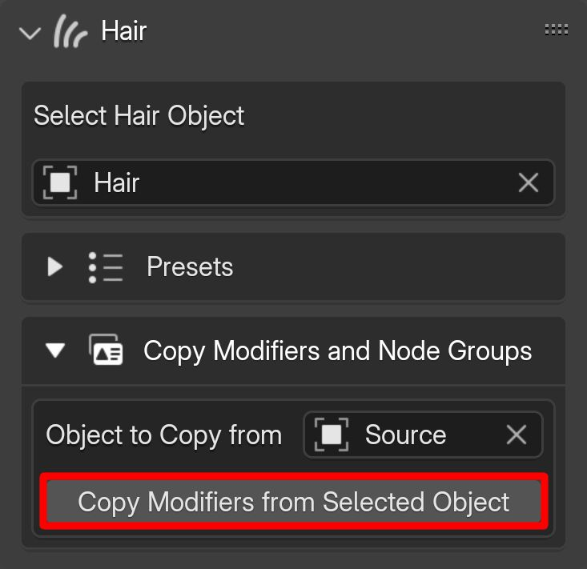

# Copying Modifiers

To copy modifiers and node groups from another hair object, open the "Copy Modifiers and Node Groups" section while the hair is selected in the add-on's hair panel.

In the picker field, select the hair object you want to copy the modifiers from.

{.responsive-img}

After selecting the source object, the "Copy Modifiers from Selected Object" button will appear.

{.responsive-img}

---