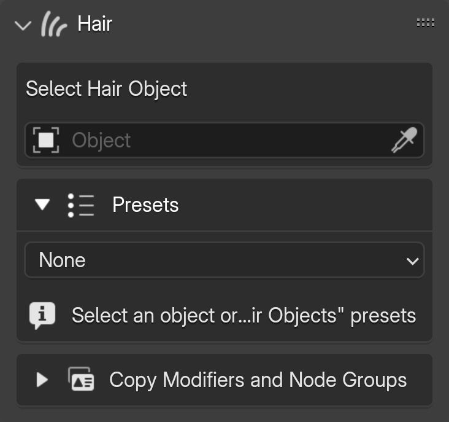

# Hair

The "Select Hair Object" option is at the top of the add-on panel. You can choose either a **curve** or **hair curves** object as the hair object. Once selected, most GBH Tool operations will be applied to this object.

{.responsive-img}

---