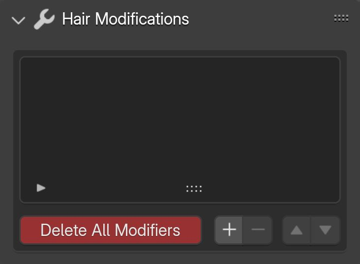
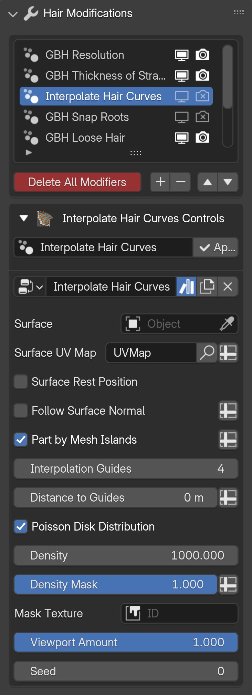
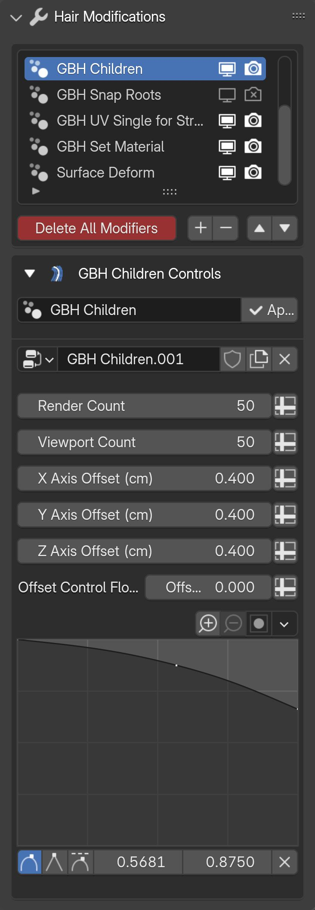
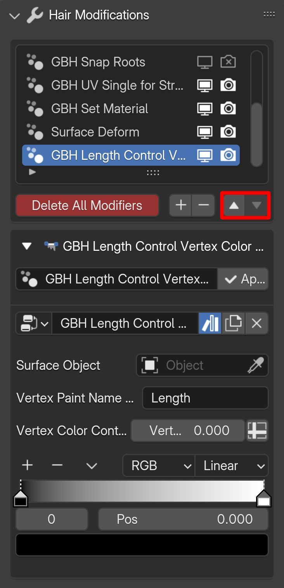
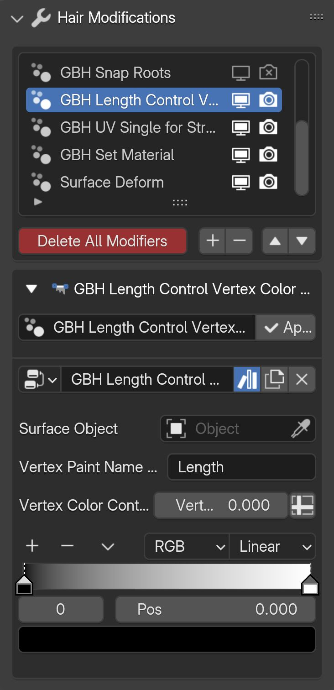
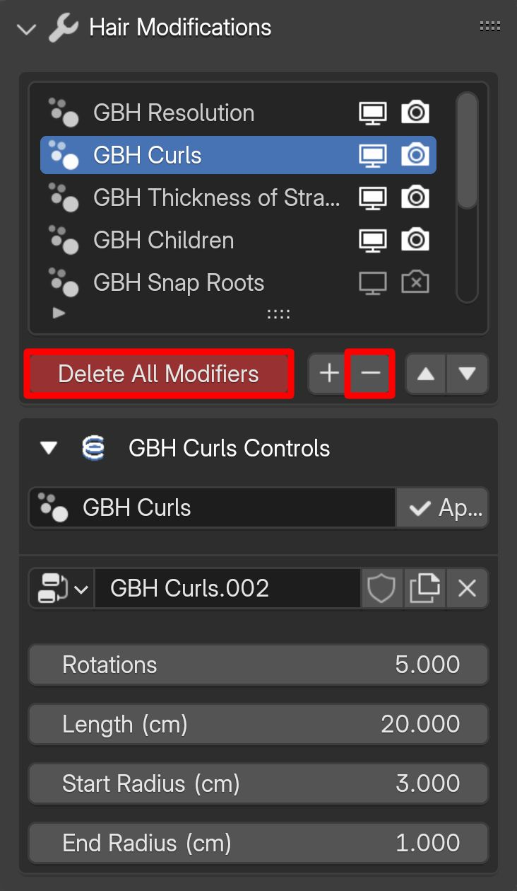
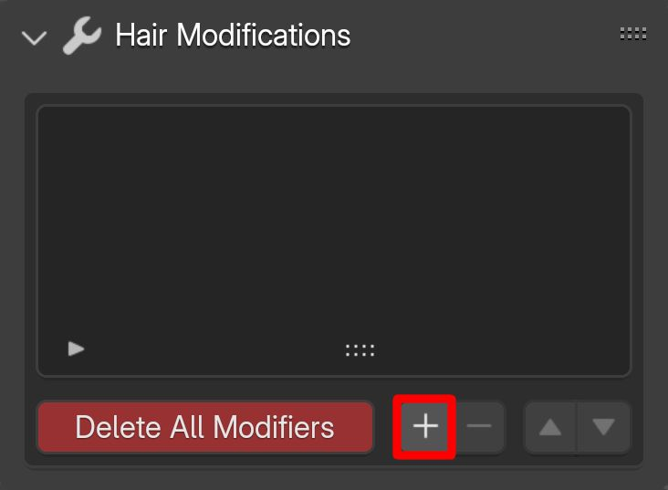
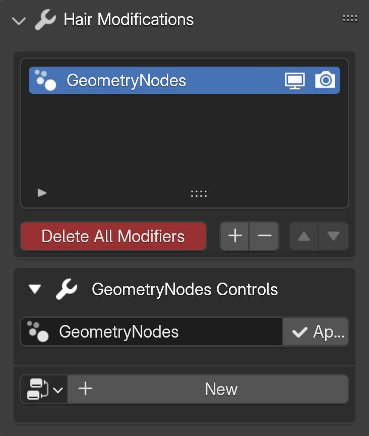

# Hair Modification

After selecting the hair object, a new section called "Hair Modifications" will appear.

{.responsive-img}

In this section, all of the hair object's modifiers are displayed. Selecting each modifier will reveal its relevant inputs and outputs.

{.responsive-img}

As you can see, this add-on can display float curves and color ramps as inputs in the modification panel. Head over to [here](../library/node_groups.md/#using-your-own-node-groups) to learn how to modify your own node groups to utilize this feature.

{.responsive-img}

---

## Arranging modifiers
The order of the modifiers can be changed using the highlighted icons.

{.responsive-img}

{.responsive-img}

---

## Adding/removing modifiers
Modifiers can be removed one by one using the minus button or all at once with the "Delete All Modifiers" button.

{.responsive-img}

A geometry nodes modifier can be added to the hair object using the [library panel](../library/ui.md/#importing-and-adding-items-to-objects) or by clicking the plus button in the "Hair Modifications" panel. This will add an empty geometry nodes modifier to the selected hair object, allowing you to select the desired node group.

{.responsive-img}

{.responsive-img}

---