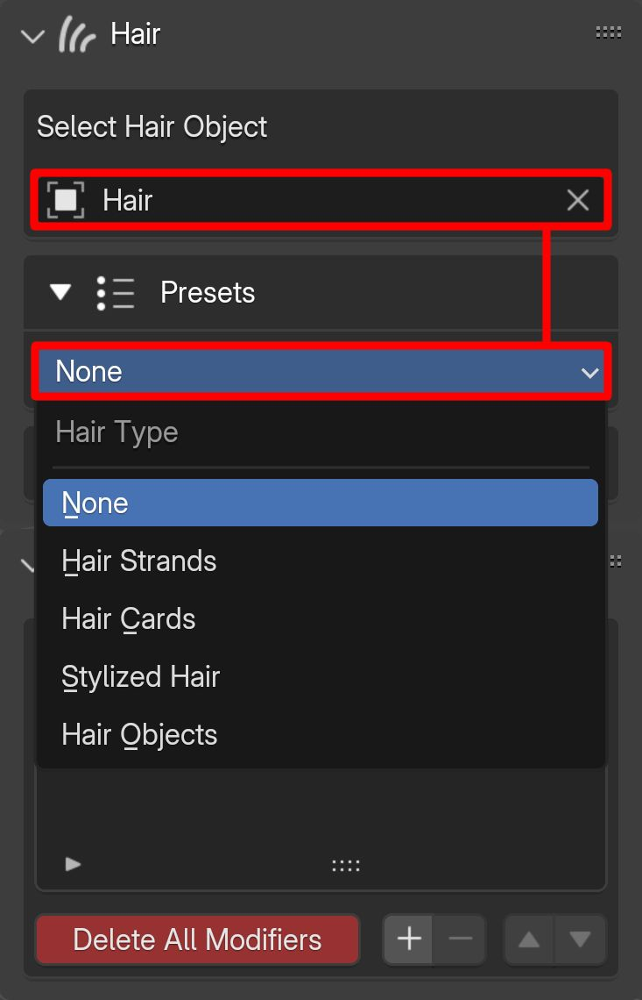
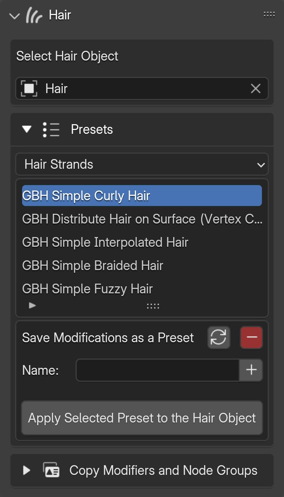
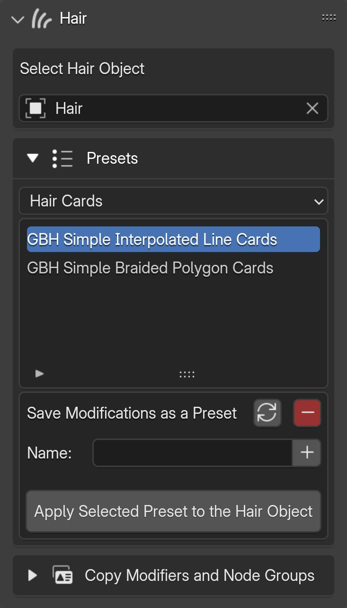
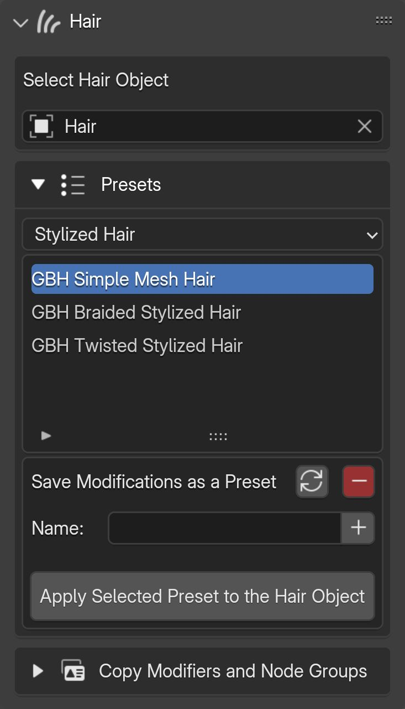
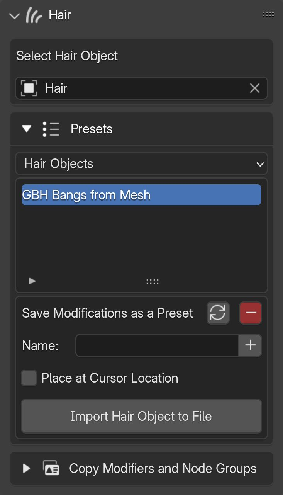
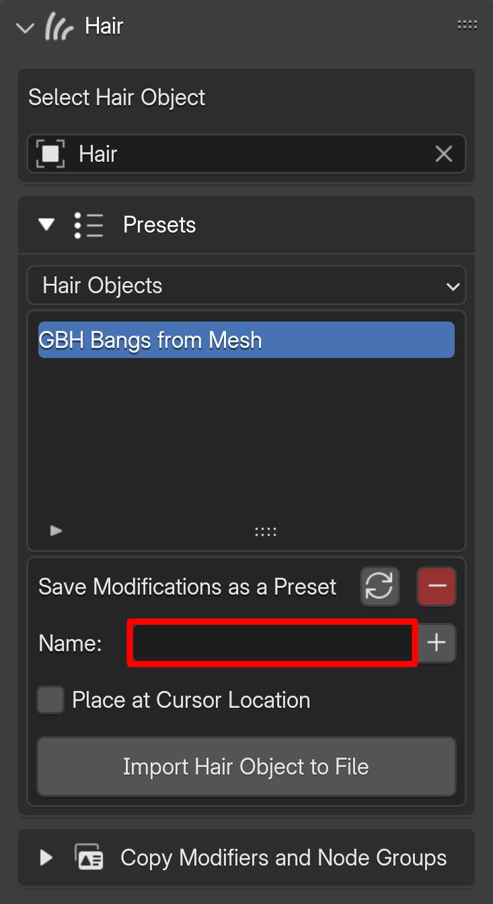
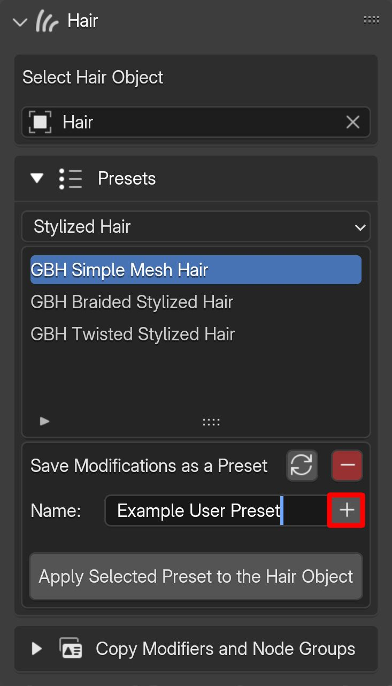
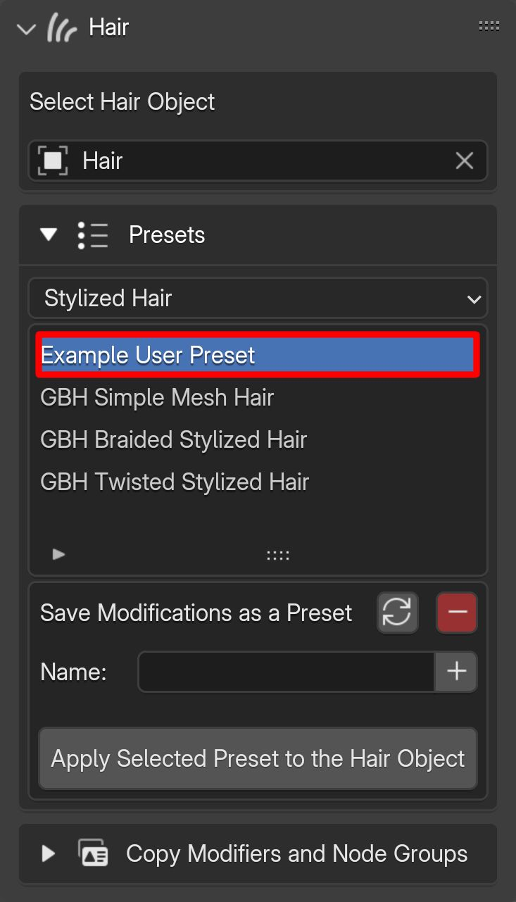

# Presets

The Presets section is located beneath the hair object selection section in the add-on panel.

---

## Categories
Presets are categorized into four groups:

- Hair Strands
- Hair Cards
- Stylized Hair
- Hair Objects

{.responsive-img}

!!! info
    Categories are used solely to organize presets. The "Hair Objects" category differs from the others because it saves and loads the hair object itself. This means you can import hair objects from this category without needing to create and select a hair object first.

---

Example pre-made presets in each category include:

{.responsive-img}

{.responsive-img}

{.responsive-img}

{.responsive-img}

---

## Applying presets to hair object
Applying a preset hair object is simple: select the desired preset and click the "Apply Selected Preset to the Hair Object" button.

!!! info
    Note that applying a preset to an object clears its existing node groups and modifiers.

---

## Saving/removing presets
You can save your modifications and the geometry node modifiers, along with their node groups, as a preset for the selected hair object. To do this, ensure the hair object and the relevant category are selected, then enter a name in the field and click the "Plus" button.

{.responsive-img}

{.responsive-img}

You can delete both your saved presets and the pre-made examples by selecting them in the list and clicking the minus button.

{.responsive-img}

---