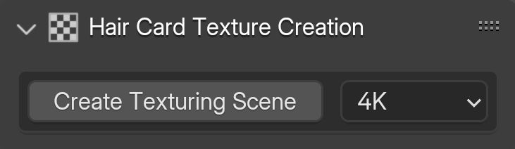
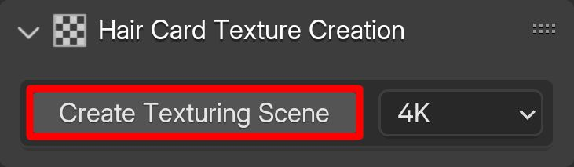
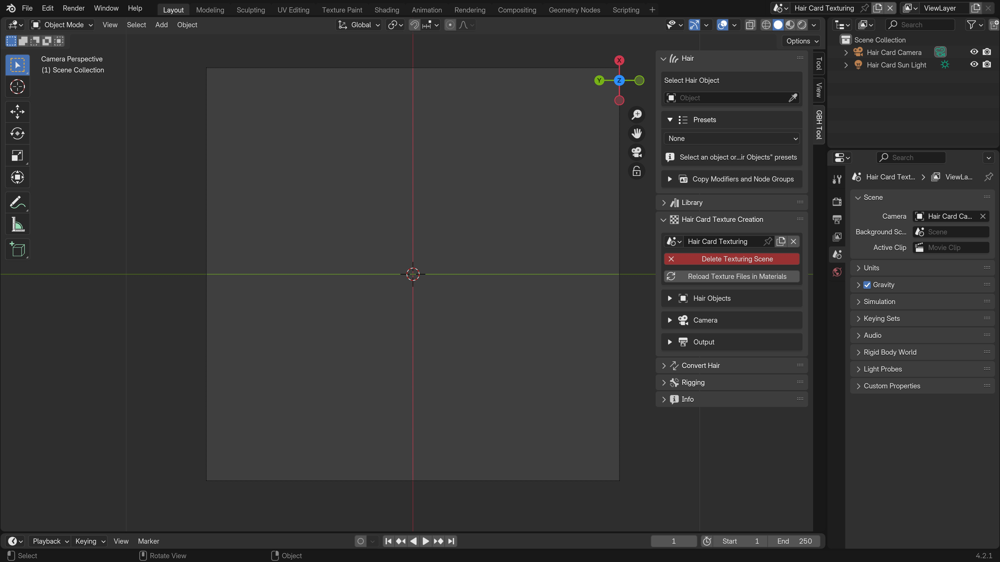
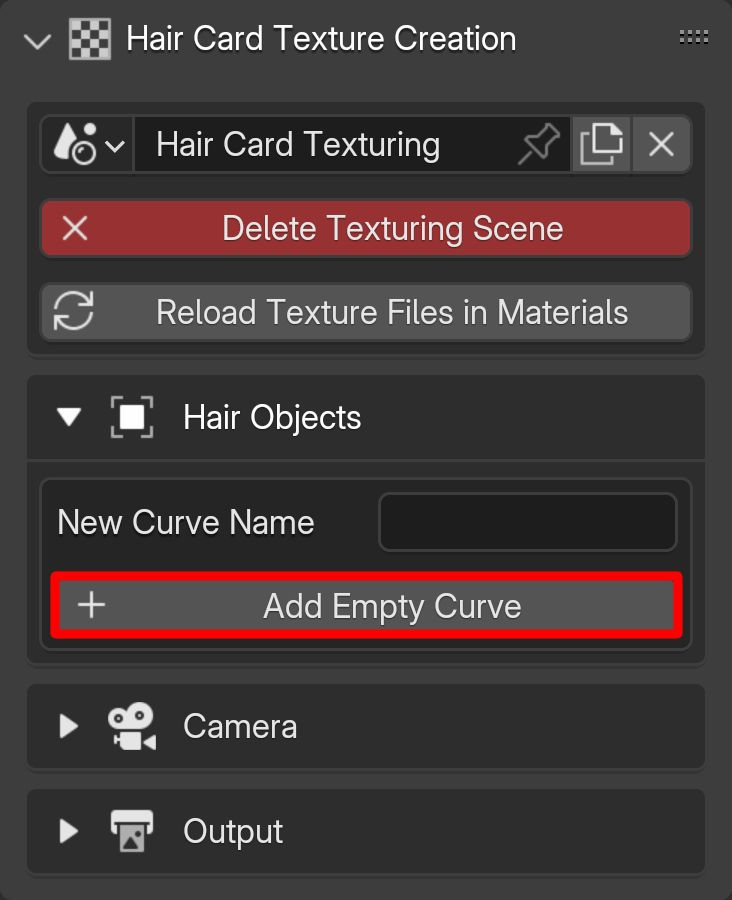
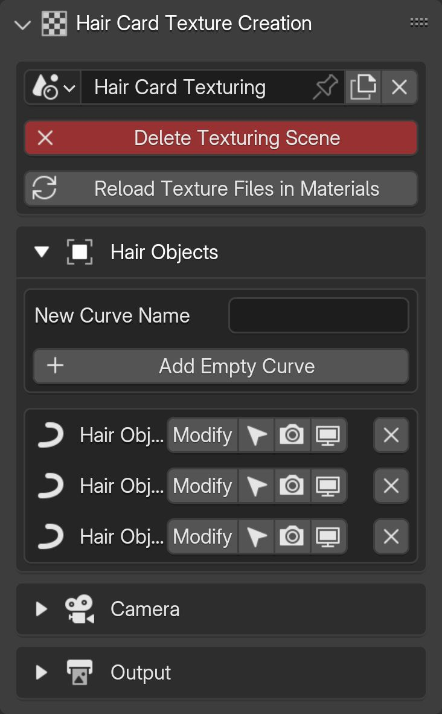
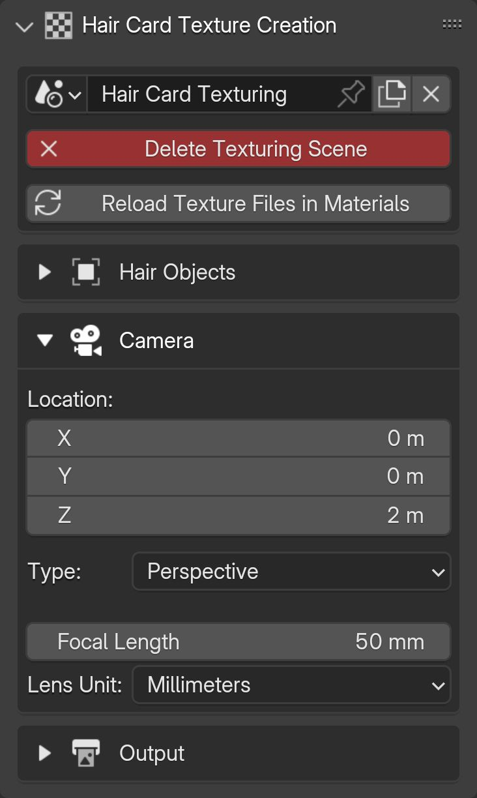
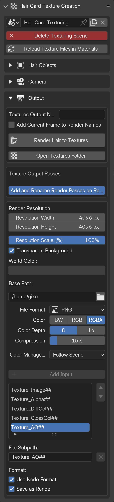

# Hair Card Texture Creation

## UI

{.responsive-img}

---

## Start creating textures
To begin creating hair card textures, first select the desired texture quality (you can change the quality later), then click "Create Texturing Scene".

{.responsive-img}
This will create a new scene in your .blend file, allowing you to create new hair objects and render them as textures.

---

## Creating hair objects
All hair curves and curve objects in the scene are listed in the "Hair Objects" section.
You can quickly create empty curve objects using "Add Empty Curve" or by using Blender's native object creation method. You can then use the draw curve tool in edit mode to quickly create the base.

{.responsive-img}

**Options:**

- Modify: Sets hair object as add-on's active hair object.
- Arrow Icon: Selects hair object in the viewport.
- Visibility Options: Toggles visibility of the object in the viewport and the renders.
- Cross Icon: Deletes the hair object entirely from the file.

{.responsive-img}

---

## Camera settings
In this section, the settings of the scene's default camera are displayed.

{.responsive-img}

---

## Output settings

**Options:**

- Add Current Frame to Render Names: Adds the frame number at the end of the rendered texture files.
- Render Hair to Textures: Renders created hairs as selected passes into the selected directory.
- Open Textures Folder: Opens the selected output folder by your OS.
- Texture Output Passes: Selected passes will be rendered as individual texture files.
- Add and Render Passes on Render: Automatically adds the render passes and changes their naming when render button is pressed.
- Add and Rename Render Passes: Adds the render passes on click.
- Render Resolution and Output Formats: Changes the rendered textures resolution and format.
- Base Path: The path that the textures will be saved.
- Subpath List: List of selected passes and their names.

{.responsive-img}