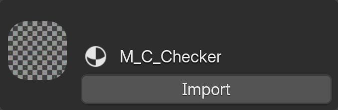
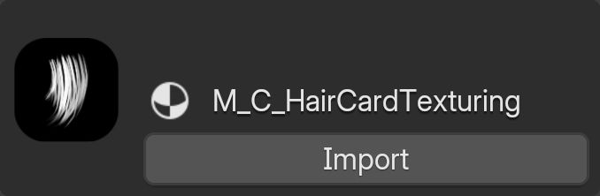
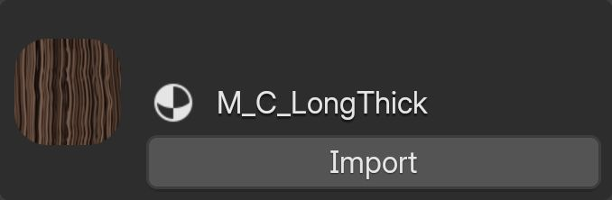
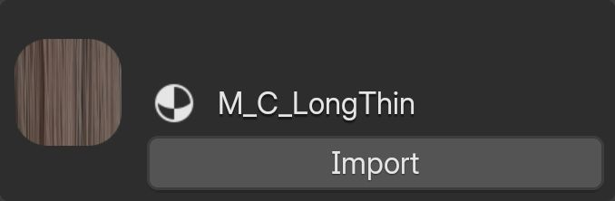
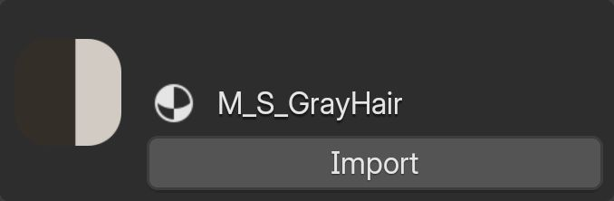
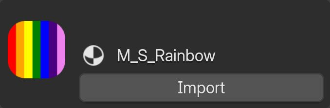
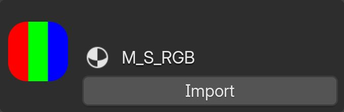
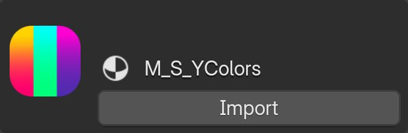

# Materials
GBH materials are divided into two types: those used for mesh-based hair and those used for strand-based hair. You can distinguish them by their names—materials for mesh-based hair start with "M_C," while those for strand-based hair start with "M_S".

## M_C_Checker
This material's primary purpose is to check the UV mapping of the hair. 

{.responsive-img}

## M_C_Haircard_Texturing
This material's purpose is to be used with hair card texture creation feature of the add-on.

{.responsive-img}

## M_C_Long_Thick
Sample material for hair cards.

{.responsive-img}

## M_C_Long_Thin
Sample material for hair cards.

{.responsive-img}

## M_S_Gray_Hair
Sample material for gray hair and strand-based hair.

{.responsive-img}

## M_S_Rainbow
Sample material for strand-based hair and texture coordination on strand-based hair.

{.responsive-img}

## M_S_RGB
Sample material for strand-based hair and texture coordination on strand-based hair.

{.responsive-img}

## M_S_SimpleProcedural
Sample material for strand-based hair and procedural color gradient coordination on strand-based hair.

{.responsive-img}

## M_S_YColors
Sample material for strand-based hair and texture coordination on strand-based hair.

{.responsive-img}