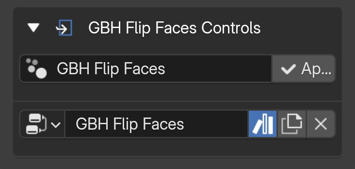
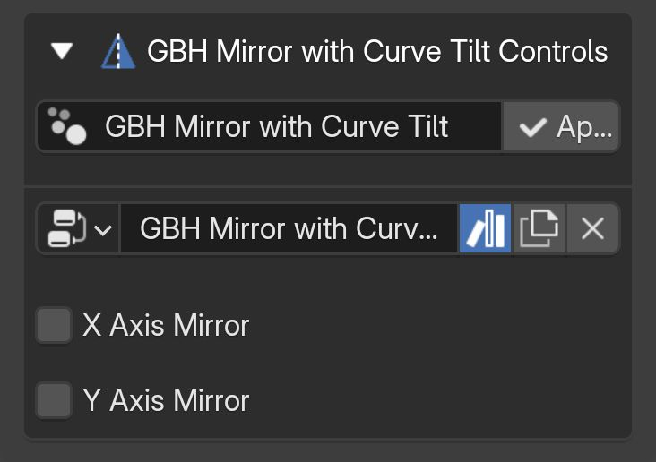
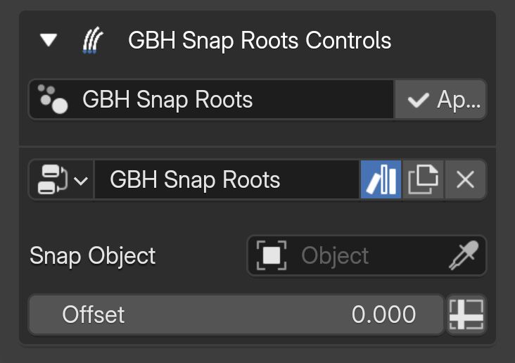
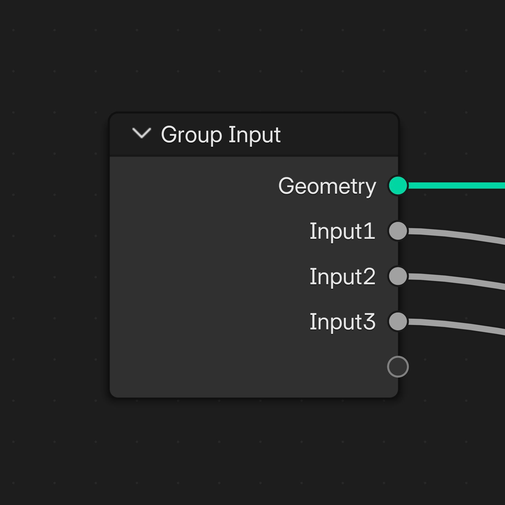
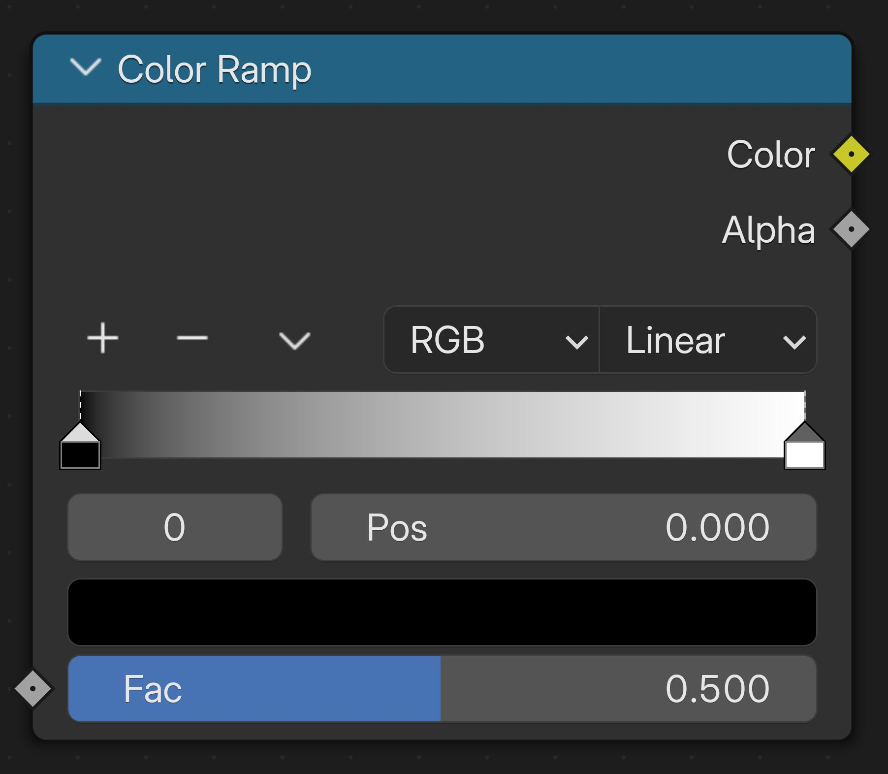
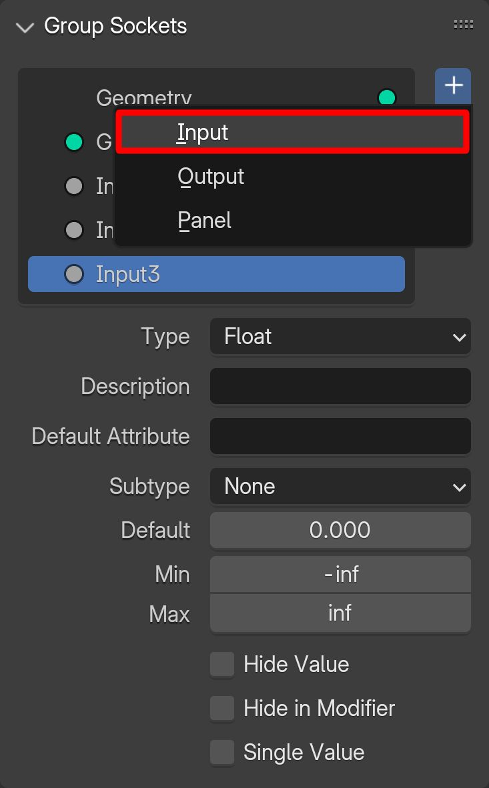

# Node Groups

## Pre-defined GBH node groups

**Braids**

Creates braided hair from each hair curve.

**Controls:**

- Threads: Number of threads in the braid.
- X Axis Width: Total width of the braided hair on the X axis.
- Y Axis Width: Total width of the braided hair on the Y axis.
- Width Control Float Curve: Control the total width of the braided hair over its length.
- Tightness: Tightness of the braids.
- Tightness Control Float Curve: Control the tightness of the braided hair over its length.

{.responsive-img}

---

**Profile Line Hair Cards**

Creates hair cards with a linear profile from each hair curve.

**Controls:**

- Profile Width: Total width of each card.
- Resolution: Number of segments along the width of each card.
- Convexity: Convexity of the cards' width (needs the width resolution to be more than 1).

**Outputs:**

- UVMap: This attribute is used in combination with UV node groups to generate UV mapping for the hair.
- Hair Length: This attribute is used with multi-material/UV node groups to assign different UV islands/materials to hair based on length.

{.responsive-img}

---

**Profile Polygon Hair Cards**

Creates hair cards with a polygon profile from each hair curve.

**Controls:**

- Profile Width: Total width of each card.
- Resolution: Number of polygon sides for the profile.

**Outputs:**

- UVMap: This attribute is used in combination with UV node groups to generate UV mapping for the hair.
- Hair Length: This attribute is used with multi-material/UV node groups to assign different UV islands/materials to hair based on length.

{.responsive-img}

---

**Children**

Duplicates each hair curve in the given radius and count.

**Controls:**

- Render Count: Total number of duplicates for each hair curve in render view.
- Viewport Count: Total number of duplicates for each hair curve shown in viewport.
- X Axis Offset: Maximum distance of each duplicate from its original hair curve on the X axis.
- Y Axis Offset: Maximum distance of each duplicate from its original hair curve on the Y axis.
- Z Axis Offset: Maximum distance of each duplicate from its original hair curve on the Z axis.
- Offset Control Float Curve: Amount of duplicates offset on all axis over the length of hair curves.

{.responsive-img}

---

**Close Caps by Radius**

It was necessary to use a work-around in order to make cyclic profiled mesh-based UV controllable, which makes Blender's close caps not work as expected. As a work-around, this node group can be used to close caps on stylized hair or hair cards with polygon profile.

**Controls:**

- Close Start Caps: Closes starting caps of hair curves by setting the radius to zero on the curves' starting points.
- Close End Caps: Closes ending caps of hair curves by setting the radius to zero on the curves' ending points.

{.responsive-img}

---

**Convert Hair**

Used for converting hair into mesh.

**Controls:**

- Hair Object: Source object to get the mesh from.

{.responsive-img}

---

**Curls**

Creates curly hair from each hair curve.

**Controls:**

- Rotations: Total number of rotations for each hair curve curl.
- Length: Total length of each hair curve.
- Start Radius: Starting diameter of hair curl.
- End Radius: Ending diameter of hair curl.

{.responsive-img}

---

**Curve Render Profile**

When using a curve object as the base of the hair object, Blender won't render it the same way it renders hair curves. As a work-around, this node group can be assigned to the curve object, which creates a profile for each curve, and Blender renders it similarly to hair curves.

{.responsive-img}

---

**Profile Custom**

Assigns a custom profile to each curve. It's suited for creating stylized hair with cyclic profile.

!!! tip
    Both mesh and curve can be used as a profile, but using a curve object is recommended.

**Controls:**

- Fill Caps: Closes caps of the profile (might not work, use "Close Caps by Radius" node group instead).
- Profile Object: Object used as a profile for each curve.

**Outputs:**

- UVMap: This attribute is used in combination with UV node groups to generate UV mapping for the hair.
- Hair Length: This attribute is used with multi-material/UV node groups to assign different UV islands/materials to hair based on length.

{.responsive-img}

---

**Profile Custom Non-cyclic**

Assigns a custom profile to each curve. It's suited for creating stylized hair with a non-cyclic profile.

!!! tip
    Both mesh and curve can be used as a profile, but using a curve object is recommended.

**Controls:**

- Profile Object: Object used as a profile for each curve.

**Outputs:**

- UVMap: This attribute is used in combination with UV node groups to generate UV mapping for the hair.
- Hair Length: This attribute is used with multi-material/UV node groups to assign different UV islands/materials to hair based on length.

{.responsive-img}

---

**Delete by Length**

Deletes curves in the selected length range.

**Controls:**

- Less Than: Curves with a length of less than the given number will be removed.
- More Than: Curves with a length of more than the given number will be removed.

{.responsive-img}

---

**Density**

Reduces the density of the curves by the given ratio.

**Controls:**

- Density: Percentage of remaining curves compared to the original count of them.

{.responsive-img}

---

**Distribute on Surface Image Texture**

Distributes curves on the given surface controlled by an image texture.

**Controls:**

- Surface Object: Surface object which curves will be distributed along its normals.
- UVMap: UV map of the surface object.
- Distribute Mask Texture: Black and white texture used to control the density of distributed hair (white areas are most dense).
- Distribute Mask Texture Color Ramp: Controls the mask texture color transition for finer control over distribution.
- Hair Density: Total number of curves distributed on the surface.
- Hair Length: Length of each distributed curve.
- Variable Length Switch: Toggles control of curves length with a mask texture.
- Length Mask Texture: Black and white texture used to control the length of distributed hair (white areas are longest).
- Length Mask Texture Color Ramp: Controls the mask texture color transition for finer control over curves length.
- Render Resolution: Controls the amount of segments along each curve's length in the render view.
- Viewport Resolution: Controls the amount of segments along each curve's length shown in the viewport.
- Follow Guide Switch: Toggles distributed hair being affected by hair object curves.
- Guide Resolution: Controls the amount of segments along each hair object curve's (guide curve) length.
- Guide Effect Radius: The maximum distance guide curve affects the distributed curves.
- Guide Power: Power of the guide curves over distributed curves.

{.responsive-img}

---

**Distribute on Surface Vertex Color**

Distributes curves on the given surface controlled by the vertices' color.

**Controls:**

- Surface Object: Surface object which curves will be distributed along its normals.
- Distribute Vertex Color Name Attribute: Name of the black and white vertex coloring used to control the density of distributed hair (white areas are most dense).
- Distribute Vertex Color Control Color Ramp: Controls the vertex color transition for finer control over distribution.
- Hair Density: Total number of curves distributed on the surface.
- Hair Length: Length of each distributed curve.
- Variable Length Switch: Toggles control of curves length with a vertex color.
- Length Vertex Color Name Attribute: Name of the black and white vertex color used to control the length of distributed hair (white areas are longest).
- Length Vertex Color Control Color Ramp: Controls the vertex color transition for finer control over curves length.
- Render Resolution: Controls the amount of segments along each curve's length in the render view.
- Viewport Resolution: Controls the amount of segments along each curve's length shown in the viewport.
- Follow Guide Switch: Toggles distributed hair being affected by hair object curves.
- Guide Resolution: Controls the amount of segments along each hair object curve's (guide curve) length.
- Guide Effect Radius: The maximum distance guide curve affects the distributed curves.
- Guide Power: Power of the guide curves over distributed curves.

{.responsive-img}

---

**Fake Wind**

Creates a fake wind effect for animating the hair object.

**Controls:**

- Amount: Amount of wind blown at the hair object.
- X Axis Speed: Speed of blown wind on the X axis.
- Y Axis Speed: Speed of blown wind on the Y axis.
- Scale: Scale of the hair movement caused by wind.
- Roughness: Roughness of the wind effect.

{.responsive-img}

---

**Flip Faces**

Flips the face normals of mesh-based hair objects.

{.responsive-img}

---

**Length Control Image Texture**

Controls the length of hair curves by an image texture.

**Controls:**

- Surface Object: Surface object which hair curves are attached to.
- UVMap: UV map of the surface object.
- Mask Texture: Black and white texture used to control the length of distributed hair (white areas are longest).
- Mask Texture Color Ramp: Controls the mask texture color transition for finer control over curves length.

{.responsive-img}

---

**Length Control Vertex Color**

Controls the length of hair curves by the object's vertex color.

**Controls:**

- Surface Object: Surface object which hair curves are attached to.
- Vertex Paint Name Attribute: Name of the black and white vertex color used to control the length of distributed hair (white areas are longest).
- Vertex Color Control Color Ramp: Controls the vertex color transition for finer control over curves length.

{.responsive-img}

---

**Loose Hair**

Adds loose hair strands for more realism.

**Controls:**

- Count per Parent: Number of loose hair per hair curve parent.
- Resolution: Controls the amount of segments along each loose hair's length.
- Density: Percentage of loose hair strands to all the hair strands.
- Fuzziness: Fuzziness of loose hair.
- Spread Min: Minimum distance of loose hair from its original parent.
- Spread Max: Maximum distance of loose hair from its original parent.

{.responsive-img}

---

**Set Material**

Sets the material of the hair object. Can be used with both strand hair and hair as mesh.

**Controls:**

- Materials: Material that will be applied to the hair object.

{.responsive-img}

---

**Set Material Multiple Mesh Hair**

Assigns multiple materials by length to the hair object. Can only be used with hair as mesh.

**Controls:**

- Material 1: Material that will be applied to the hair shorter than the given length.
- Max Material 1 Hair Length: Maximum hair length that Material 1 will be assigned to.
- Material 2: Material that will be applied to the hair shorter than the given length.
- Max Material 2 Hair Length: Maximum hair length that Material 2 will be assigned to.
- Material 3: Material that will be applied to the hair longer than the given length.
- Hair Length Attribute: Name of the attribute containing hair length data.

{.responsive-img}

---

**Mesh to Strands**

Converts the given collection of meshes into hair strands.

**Controls:**

- Object Collection: Collection of objects that hair strands will be created from.
- Subdivision: Number of subdivisions that will be applied to mesh objects.

!!! tip
    This node group uses edge crease values to determine the roots of the hair strands. To ensure that your hair strands have proper roots, you can add edge creases by entering edit mode and selecting the edges where the roots should be. Next, press "Shift + E" on your keyboard, and drag your mouse all the way up before left-clicking to create the crease. The edge should turn pink to confirm that the crease has been added.

{.responsive-img}

---

**Mirror**

Mirrors the hair curves on the given axis.

**Controls:**

- X Axis Mirror: Mirrors hair curves on the X axis.
- Y Axis Mirror: Mirrors hair curves on the Y axis.

{.responsive-img}

---

**Mirror with Curve Tilt**

Mirrors the hair curves on the given axis while mirroring the hair curves' tilts. Suitable to use with curve objects and stylized/curly hair.

**Controls:**

- X Axis Mirror: Mirrors hair curves on the X axis.
- Y Axis Mirror: Mirrors hair curves on the Y axis.

{.responsive-img}

---

**Noise Generic**

Adds noise to hair using noise texture.

**Controls:**

- Scale: Size of the noise.
- Amount: Amount of the noise.
- Factor Offset: Offset the starting position of noise from hair roots.

{.responsive-img}

---

**Noise Strand Hair**

Adds noise to hair by randomly moving hair curve points.

**Controls:**

- Length: Size of the noise.
- Amount: Amount of the noise.
- Resolution: Distance between selected points to move randomly.
- Factor Offset: Offset the starting position of noise from hair roots.

{.responsive-img}

---

**Profile Width Control**

Controls the overall width of the profile assigned to hair curves. Suitable to use with stylized/curly hair.

**Controls:**

- Width Control Float Curve: Controls the overall width of the profile along the curve's length.

{.responsive-img}

---

**Resolution**

Sets the resolution (number of segments on each hair).

**Controls:**

- Render Resolution: Distance between segments along the length of each curve in the render view.
- Viewport Resolution: Distance between segments along the length of each curve shown in the viewport.

{.responsive-img}

---

**Reverse Curve**

Reverses the direction of curves.

{.responsive-img}

---

**Rolls**

Creates rolled hair from each hair curve.

**Controls:**

- Offset: Distance between the root and the beginning of the roll on the curve.
- Rotations: Amount of rotations on each roll.
- Scale: Size of the overall diameter of each roll.
- X Axis Rotation: Rotates each roll on the X axis.
- Y Axis Rotation: Rotates each roll on the Y axis.
- Z Axis Rotation: Rotates each roll on the Z axis.

{.responsive-img}

---

**Rotation**

Rotates each curve around its root. Suitable to use for stylized/curly hair.

**Controls:**

- Rotation: Amount of degrees which each curve gets rotated.

{.responsive-img}

---

**Rotation Additive Tilt**

Rotates each curve around its root while keeping curve tilt. Suitable to use with curve objects for stylized/curly hair.

**Controls:**

- Rotation: Amount of degrees which each curve gets rotated.

{.responsive-img}

---

**Snap Roots**

Snaps the root of hair curves to the selected object's surface.

**Controls:**

- Snap Object: Object which the roots will be snapped to.
- Offset: Distance between hair roots and object's surface.

{.responsive-img}

---

**Snap to Object**

Snaps hair curves to the selected objects.

**Controls:**

- Snap Object Collection: Collection of objects which the hair will be snapped to.
- Ratio: Ratio of each distance scale affecting hair snap.
- Primary Scale: Primary distance scale of the selected object to hair.
- Secondary Scale: Secondary distance scale of the selected object to hair.

{.responsive-img}

---

**Thickness of Strands**

Controls the thickness of hair strands.

**Controls:**

- Thickness: Maximum thickness of each hair strand.
- Thickness Control Float Curve: Controls the overall thickness of strands over their length.

{.responsive-img}

---

**Trim Hair**

Trims hair curves length.

**Controls:**

- Amount: Ratio of the trimmed length compared to its original length.

{.responsive-img}

---

**Twist**

Twists hair around itself, from its root. Suitable to be used for stylized/curly hair.

**Controls:**

- Amount: Amount of twist in degrees.
- Twist Control Float Curve: Controls the twist of each hair along its length.

{.responsive-img}

---

**UV Multiple for Mesh Hair**

Control multiple UV islands mapping of hair separated by length. Can only be used with hair as mesh.

**Controls:**

- Rotation: Rotation of all UV islands.
- UV 1 Offset on X Axis: Offsets UV island 1 on X axis.
- UV 1 Offset on Y Axis: Offsets UV island 1 on Y axis.
- UV 1 Scale on X Axis: Scales UV island 1 on X axis.
- UV 1 Scale on Y Axis: Scales UV island 1 on Y axis.
- Max UV 1 Hair Length: Maximum hair length that UV island 1 will be assigned to.
- UV 2 Offset on X Axis: Offsets UV island 2 on X axis.
- UV 2 Offset on Y Axis: Offsets UV island 2 on Y axis.
- UV 2 Scale on X Axis: Scales UV island 2 on X axis.
- UV 2 Scale on Y Axis: Scales UV island 2 on Y axis.
- Max UV 2 Hair Length: Maximum hair length that UV island 2 will be assigned to.
- UV 3 Offset on X Axis: Offsets UV island 3 on X axis.
- UV 3 Offset on Y Axis: Offsets UV island 3 on Y axis.
- UV 3 Scale on X Axis: Scales UV island 3 on X axis.
- UV 3 Scale on Y Axis: Scales UV island 3 on Y axis.

**Outputs:**

UVMap: Attribute which can be used to transfer UV mapping to materials.

!!! tip
    In order to use the UV map generated by this node group, you must add an attribute node in materials and give the output attribute of this node group to it, then feed the vector value to the texture/color of the material.

    UV map generated by this node group will be automatically converted to UV data when converting the hair by add-on.

{.responsive-img}

---

**UV Multiple for Strand Hair**

Control multiple UV islands mapping of hair separated by length. Can only be used with hair strands.

**Controls:**

- Rotation: Rotation of all UV islands.
- UV 1 Offset on X Axis: Offsets UV island 1 on X axis.
- UV 1 Offset on Y Axis: Offsets UV island 1 on Y axis.
- UV 1 Scale on X Axis: Scales UV island 1 on X axis.
- UV 1 Scale on Y Axis: Scales UV island 1 on Y axis.
- Max UV 1 Hair Length: Maximum hair length that UV island 1 will be assigned to.
- UV 2 Offset on X Axis: Offsets UV island 2 on X axis.
- UV 2 Offset on Y Axis: Offsets UV island 2 on Y axis.
- UV 2 Scale on X Axis: Scales UV island 2 on X axis.
- UV 2 Scale on Y Axis: Scales UV island 2 on Y axis.
- Max UV 2 Hair Length: Maximum hair length that UV island 2 will be assigned to.
- UV 3 Offset on X Axis: Offsets UV island 3 on X axis.
- UV 3 Offset on Y Axis: Offsets UV island 3 on Y axis.
- UV 3 Scale on X Axis: Scales UV island 3 on X axis.
- UV 3 Scale on Y Axis: Scales UV island 3 on Y axis.

**Outputs:**

- UVMap: Attribute which can be used to transfer UV mapping to materials.

!!! tip
    In order to use the UV map generated by this node group, you must add an attribute node in materials and give the output attribute of this node group to it, then feed the vector value to the texture/color of the material.
    
    UV map generated by this node group will be automatically converted to UV data when converting the hair by add-on.

{.responsive-img}

---

**UV Single for Mesh Hair**

Control UV mapping of hair. Can only be used with hair strands.

**Controls:**

- Rotation: Rotation of all UV islands.
- UV Offset on X Axis: Offsets UV island on X axis.
- UV Offset on Y Axis: Offsets UV island on Y axis.
- UV Scale on X Axis: Scales UV island on X axis.
- UV Scale on Y Axis: Scales UV island on Y axis.

**Outputs:**

- UVMap: Attribute which can be used to transfer UV mapping to materials.

!!! tip
    In order to use the UV map generated by this node group, you must add an attribute node in materials and give the output attribute of this node group to it, then feed the vector value to the texture/color of the material.

    UV map generated by this node group will be automatically converted to UV data when converting the hair by add-on.

{.responsive-img}

---

**UV Single for Strand Hair**

Control UV mapping of hair. Can only be used with hair strands.

**Controls:**

- Rotation: rotation of all UV islands
- UV offset on X axis: offsets UV island on X axis
- UV offset on Y axis: offsets UV island on Y axis
- UV scale on X axis: scales UV island on X axis
- UV scale on Y axis: scales UV island on Y axis
- Random spread by index: randomly spread UV island for each hair on Y axis by index
- Min randomness on Y axis: minimum random position value of UV island for each hair on Y axis
- Maximum randomness on Y axis: maximum random position value of UV island for each hair on Y axis

**Outputs:**

- UVMap: attribute which can be used to transfer UV mapping to materials

!!! tip
    In order to use the UV map generated by this node group, you must add an attribute node in materials and give the output attribute of this node group to it, then feed the vector value to the texture/color of the material.

    UV map generated by this node group will be automatically converted to UV data when converting the hair by add-on.

{.responsive-img}

---

**Wave**

Makes hair wavy.

**Controls:**

- Length: Size of waviness of the hair.
- Amount: Amount of waviness of the hair.

{.responsive-img}

---

## Blender's hair node groups
Blender's procedural hair node groups can be used with this add-on.

For more information about the node groups, visit Blender's documentation website:

[Blender Docs](https://docs.blender.org/manual/en/latest/modeling/geometry_nodes/hair/index.html){ .md-button}

---

## Using your own node groups
You can use your own node groups from your own files.

GBH Tool automatically shows the connected input sockets of node groups in its UI.

{.responsive-img}

You can also show float curves and color ramp in its UI.

{.responsive-img}

{.responsive-img}

To do this, first select the desired node. Then, go to the "Node" section in the sidebar and copy the name of the node from the highlighted field.

{.responsive-img}

To display the nodes in the add-on's UI, you need to add an input socket to the node group with the same name as the node name you copied.

To do so, first head on to "Group" section from the sidebar.

Then click on the plus icon highlighted in the image below.

{.responsive-img}

The select "Input".

{.responsive-img}

A socket will be added to the node group. Double click on it and paste the name you copied earlier.

{.responsive-img}

As you can see in the image below, two input sockets for a color ramp and a float curve with their original names are created as an example.

{.responsive-img}

It is important to **NOT** to connect the created input sockets to anything.

{.responsive-img}

The inputs and the desired nodes will appear in the add-on's UI, like the example below:

{.responsive-img}

---