# UI

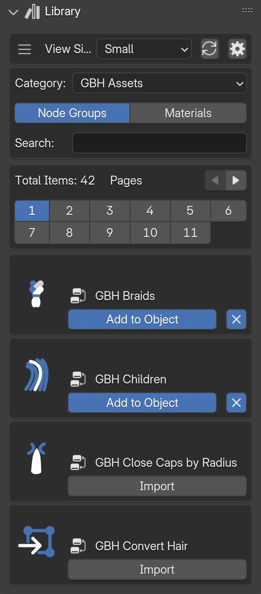{.responsive-img}

---

## Settings 
You can access the library's settings by clicking on the gear icon.

- **Add Node Groups to Active Object in Viewport:** Adds selected node groups to the active object(s) in the 3D viewport, rather than requiring a specific hair object selection.
- **Automatically Pack Resources:** Automatically embeds all external files into the current .blend file, keeping everything self-contained.
- **Select Personal Directory:** Choose a directory to load node groups from .blend files into your library.

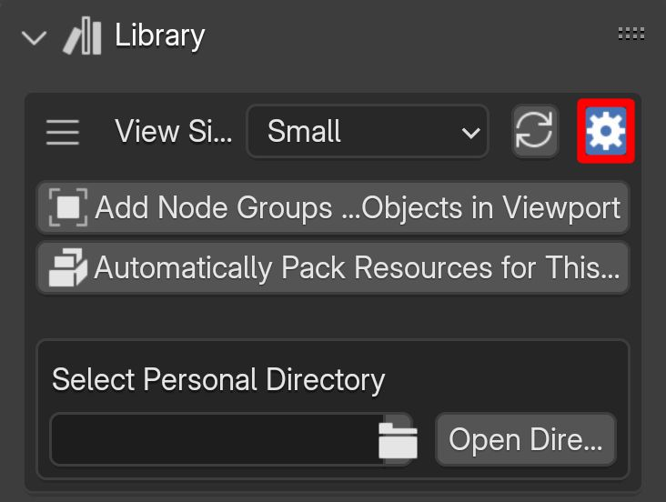{.responsive-img}

---

## View options
You can switch between grid view and list view by clicking on the icon highlighted in the image below. Number of items shown in each page can be changed in the [preferences](../preferences/library_settings.md).

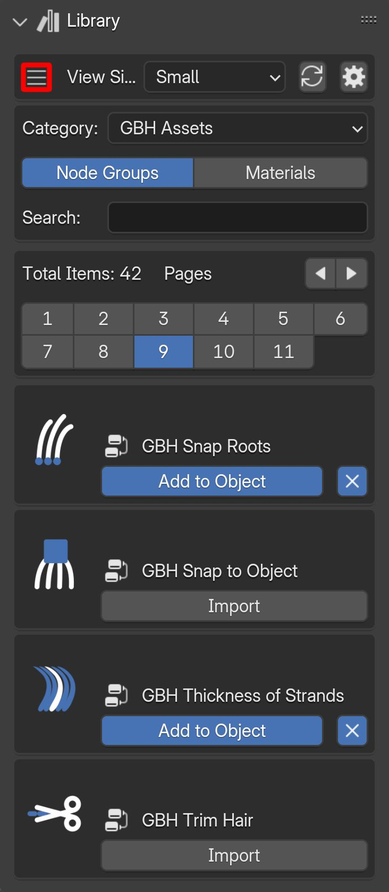{.responsive-img}

You can change the icon size using the drop-down highlighted in the image below.

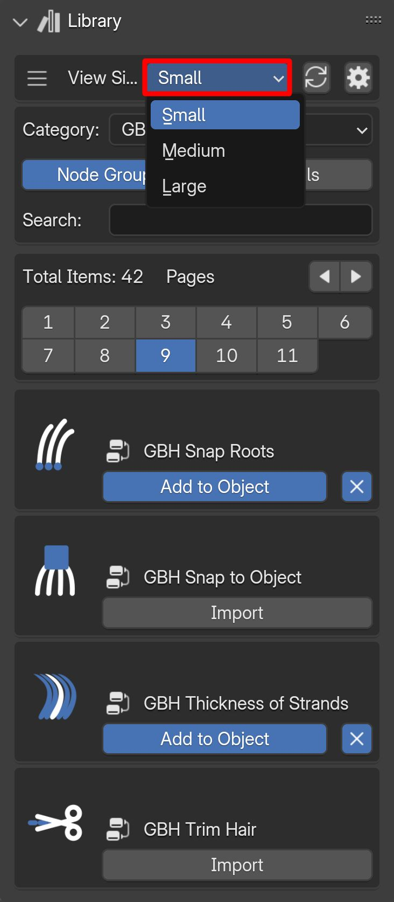{.responsive-img}

---

## Categories
Library items are categorized into three groups:

- **GBH Assets:** Pre-made node groups and materials.
- **Blender Assets:** Blender's procedural hair node groups.
- **User Assets:** Node groups from your own .blend files.

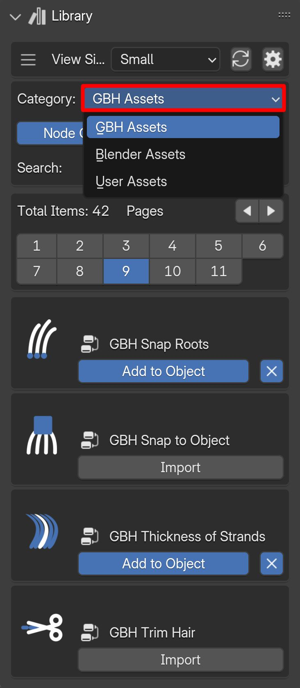{.responsive-img}

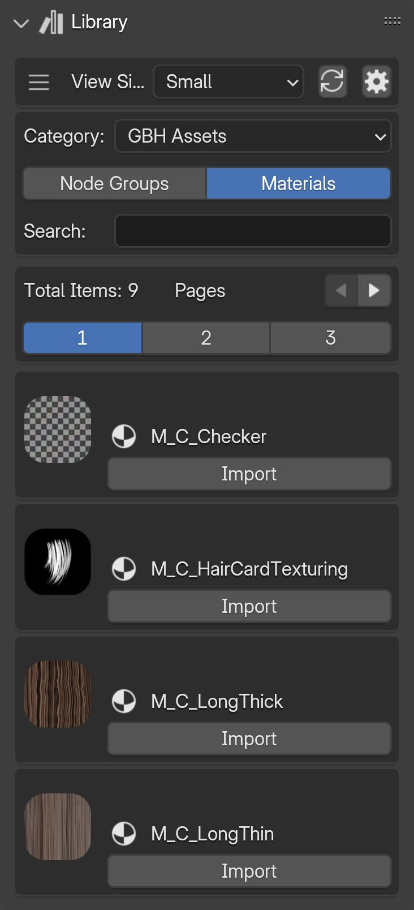{.responsive-img}

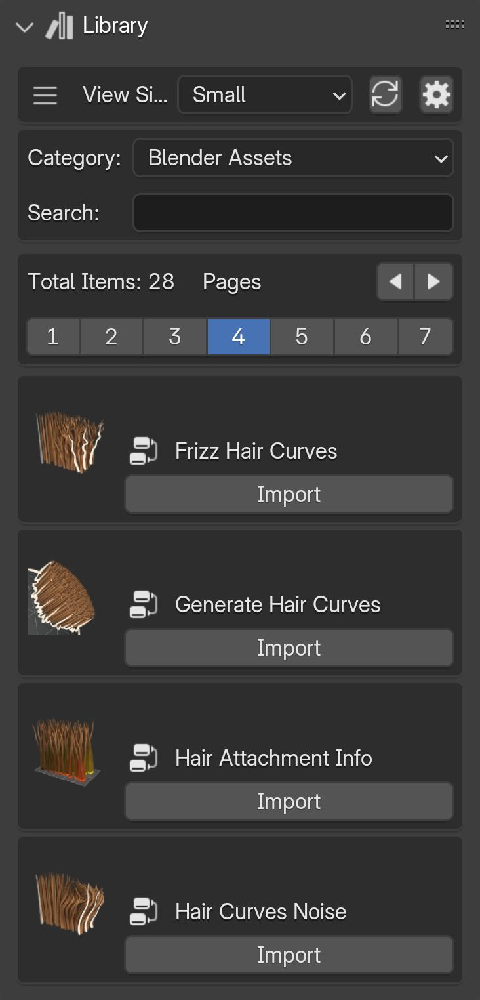{.responsive-img}

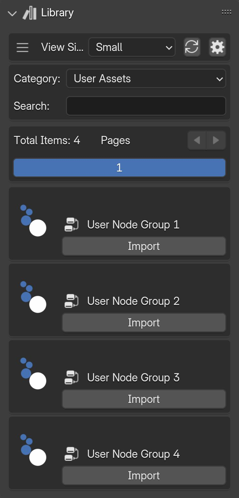{.responsive-img}

---

## Importing and adding items to objects
Importing items from the library to your current file is as simple as clicking on the "Import" button on each item.

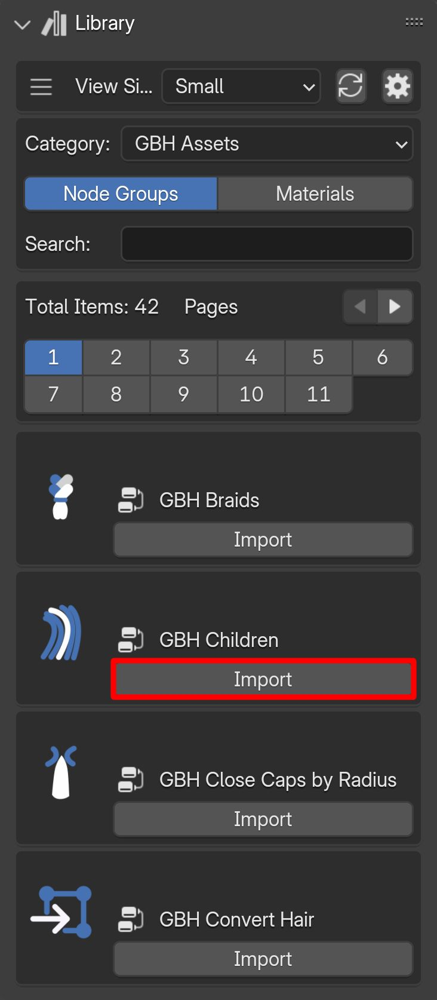{.responsive-img}

Items can be added to the selected hair object or the active object in the viewport (depending on the library settings) by clicking on the "Add to Object" button.

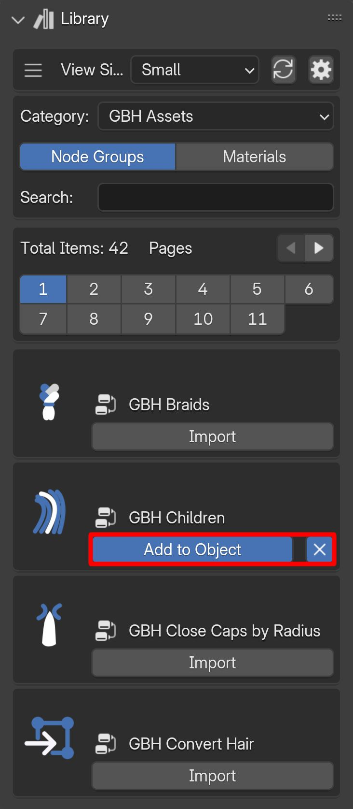{.responsive-img}

---

## Search
You can quickly filter library items by searching for keywords. To search for items, type a keyword in the search field and press "Enter" on your keyboard.

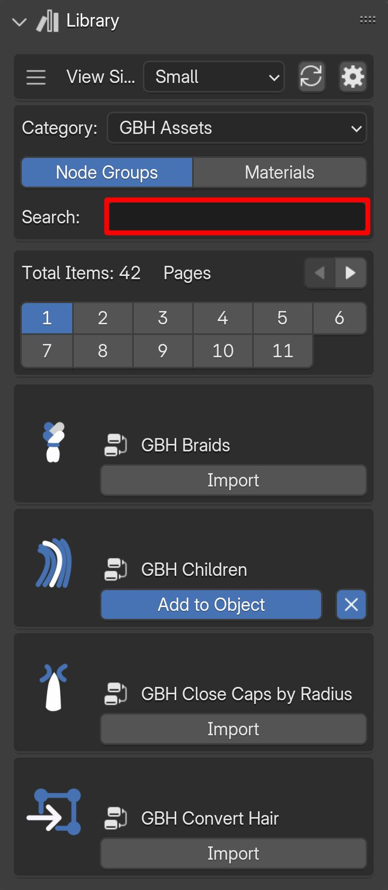{.responsive-img}

Clearing search results is done by clicking on the cross button.

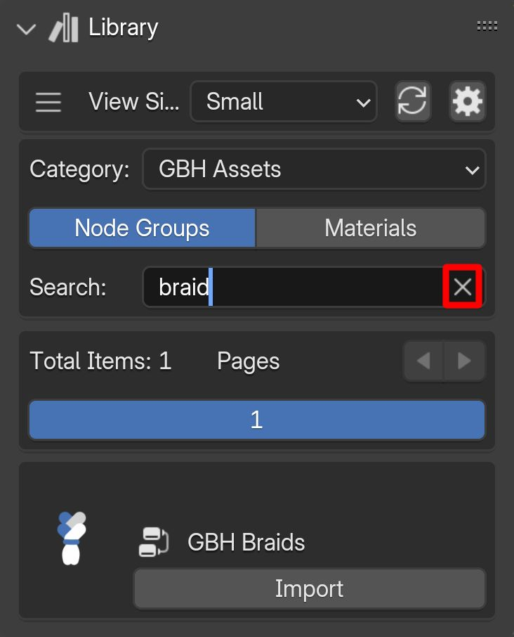{.responsive-img}

---

## Using GBH Assets in Blender's Asset Browser

- First open Blender's preferences from Edit > Preferences.

 
- Open the add-on's preferences from the "Add-ons" section by searching for "GBH Tool".

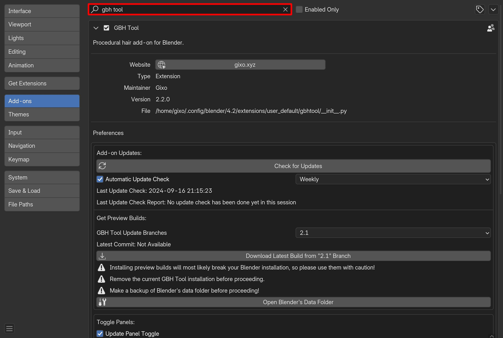

- Scroll down and add GBH assets to Blender's Asset Browser by clicking on the "Add GBH Assets to Blender's Asset Browser" button.

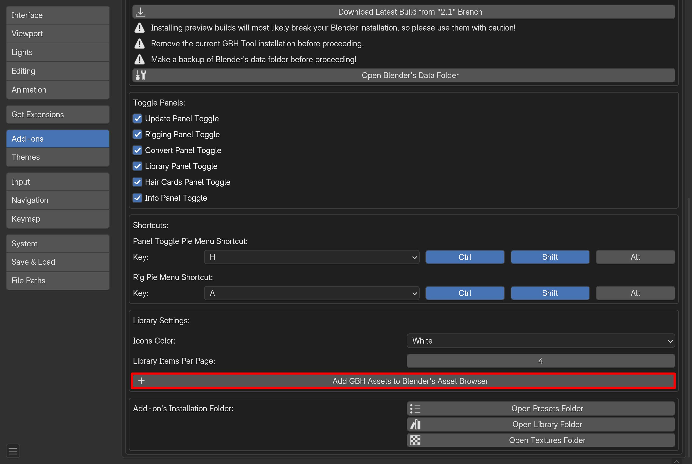

- You can confirm that the GBH Library is added to your file paths.

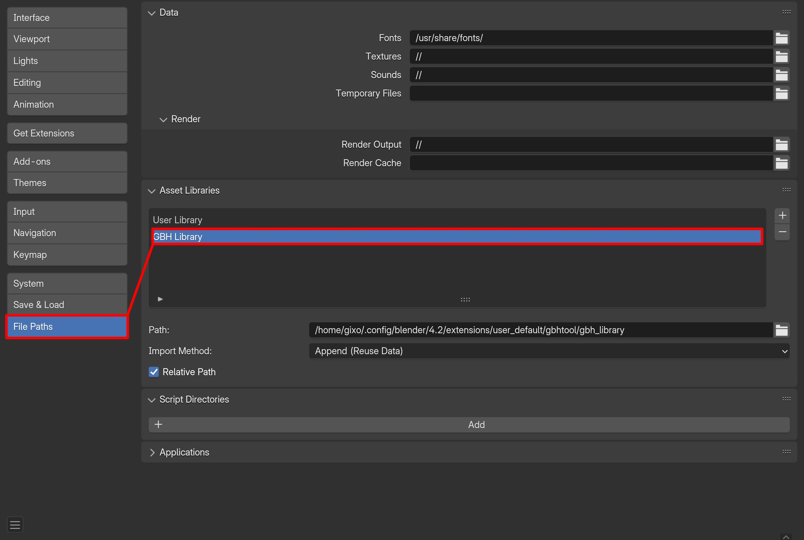

- Now you can open the Asset Browser and use the GBH assets.

!!!tip
    If the assets do not appear in the Asset Browser immediately, you may need to restart Blender for them to show up afterwards.

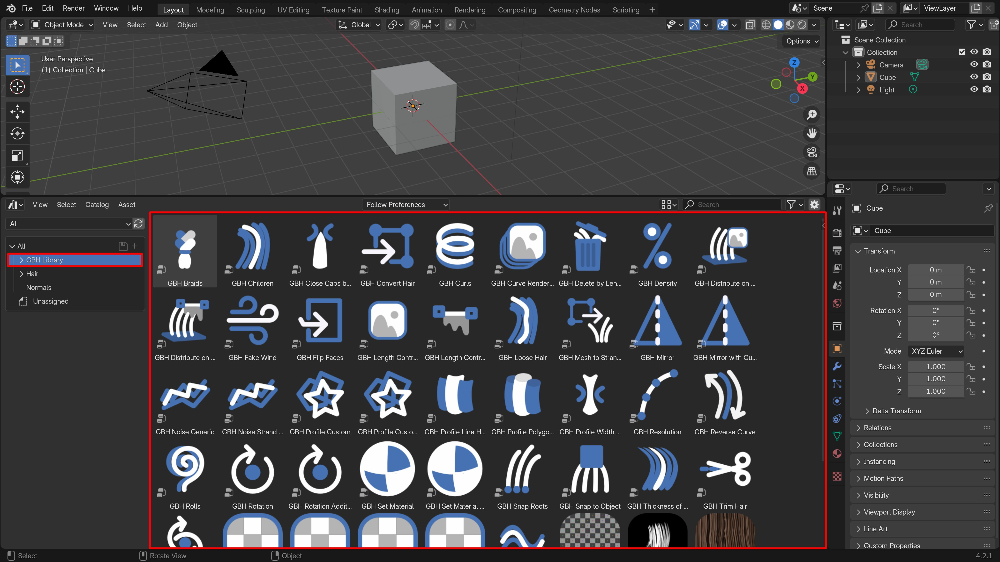

---