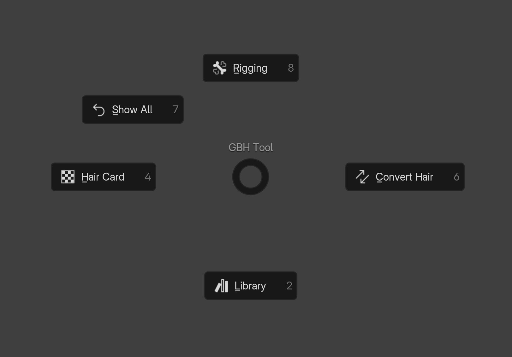
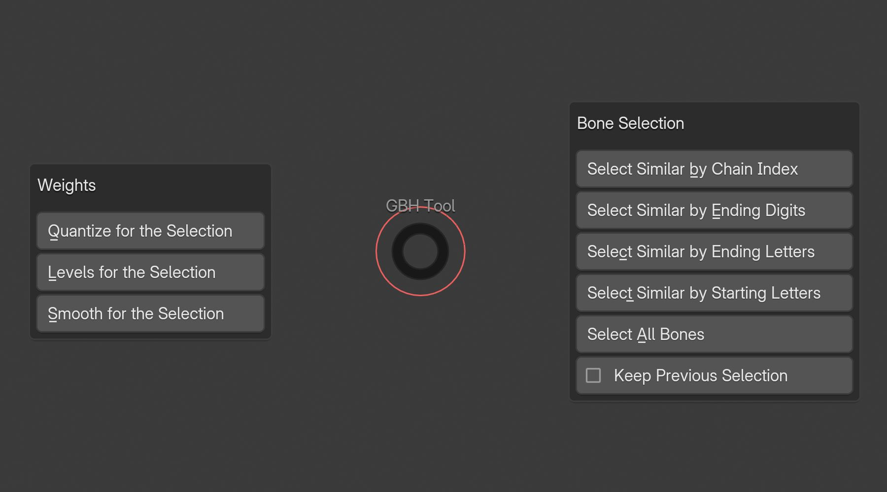

# Pie Menus

This add-on provides several pie menus to enhance workflow. You can change the shortcuts for these menus in the [Keyboard Shortcuts](../preferences/keyboard_shortcuts.md) section.

---

## Panel Toggles Pie Menu
You can quickly toggle panels using this pie menu.

**Options:**

- Toggle Library: Toggles the library panel.
- Toggle Convert Hair: Toggles the convert hair panel.
- Toggle Rigging: Toggles the rigging panel.
- Toggle Hair Card: Toggles the hair card panel.
- Show All: Displays all the panels.

---

## Rigging Pie Menu
You can perform rigging operations using this pie menu.

This menu is only available in "Weight Paint" mode and "Pose Mode".

!!! info
    Weight section is only available in "Weight Paint" mode and not in "Pose Mode" mode.

**Bone Selection Options:**

- Select Similar by Chain Index: Selects all bones with the same index in each chain.
- Select Similar by Ending Digits: Selects all bones with the same ending digits.
- Select Similar by Ending Letters: Selects all bones with the same ending letters.
- Select Similar by Starting Letters: Selects all bones with the same starting letters.
- Select All Bones: Selects all bones in the armature.
- Keep Previous Selection: If enabled, keeps the previous selection when performing any of above selection operations.

**Weight Options:**

- Quantize for the Selection: Sets weight to a fixed number of steps.
- Levels for the Selection: Adds some offset and multiply with some gain.
- Smooth for the Selection: Smooths weight of the vertices with adjacent vertices.

---

