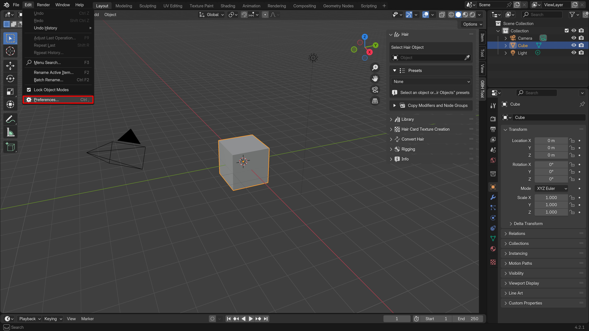
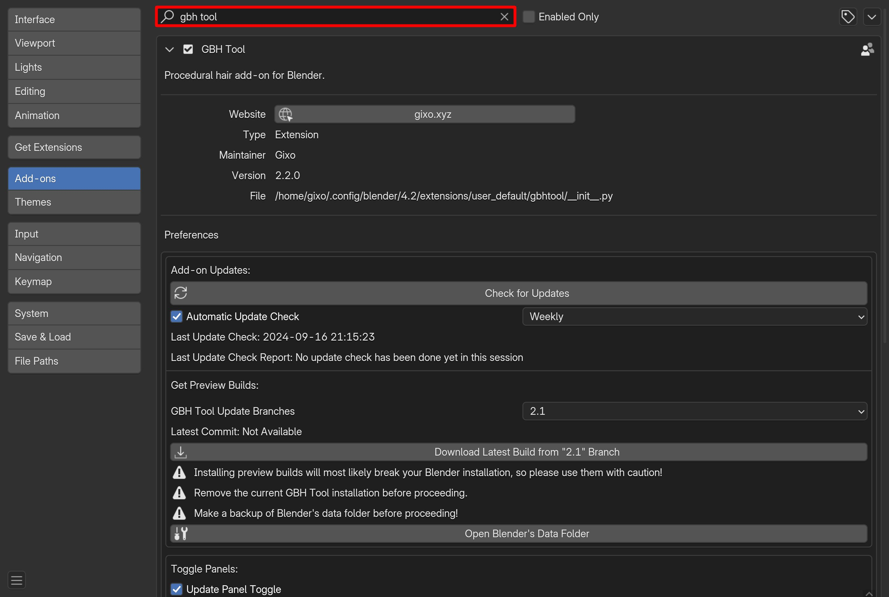
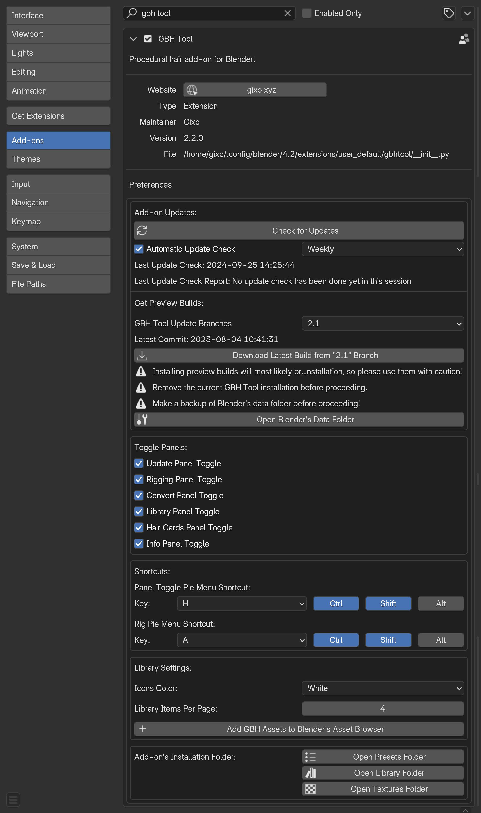

# Preferences

Add-on's preferences can be accessed by opening Blender's preferences in Edit > Preferences > Add-ons

And then search for GBH Tool in the add-ons

## Overview of the Preferences

---
