# Armature Creation

## Creating armature
This feature generates an armature for the selected hair object in the add-on's UI.

To begin creating, first select the hair object in the add-on's UI. Then, go to the "Rigging" section and, in the "Create Armature" subcategory, click on "Generate Armature".

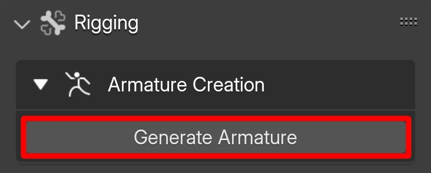{.responsive-img}

**Options:**

- Number of Bones in Each Chain: The number of bones created in each chain on each hair curve.
- Density of Bone Chains: The ratio of bone chains to the total number of hair curves.
- Reverse Chains Direction: Reverses the direction of the bone chains created on hair curves.
- Chains Start Point Trim: Adjusts the starting point of the bone chain on each hair curve.
- Chains End Point Trim: Adjusts the ending point of the bone chain on each hair curve.
- Parent bone: 
    - None: Uses no parent bone.
    - Add Parent Bone to Armature: Creates an extra parent bone located at the origin point of the hair object, setting all the bone chains to be parented to it.
    - Select Parent Bone from Another Armature: Allows you to select a bone from another armature as the parent bone.
- Armature Naming Scheme: The naming scheme for the generated armature bones and chains.
- Display armature as:
    - Octahedral: Displays the armature as octahedrons.
    - Stick: Displays the armature as sticks.
    - B-Bone: Displays the armature as B-bones.
    - Envelope: Displays the armature as envelopes.
    - Wire: Displays the armature as wires.
- Live Preview: Displays changes in real-time.
  
!!! tip
    It is recommended to turn off "Live Preview" if your computer has limited resources or if you are creating a complex armature.

- Using Hair Object's Modifiers: Uses the geometry created after applying the hair object's modifier instead of the original hair object.

!!! tip
    This option could easily result in Blender crashing if the geometry created by the modifiers is too dense.

    Make sure to back up your .blend file before using this option.

    The node groups that create mesh are not used and are listed in the highlighted section of the image.

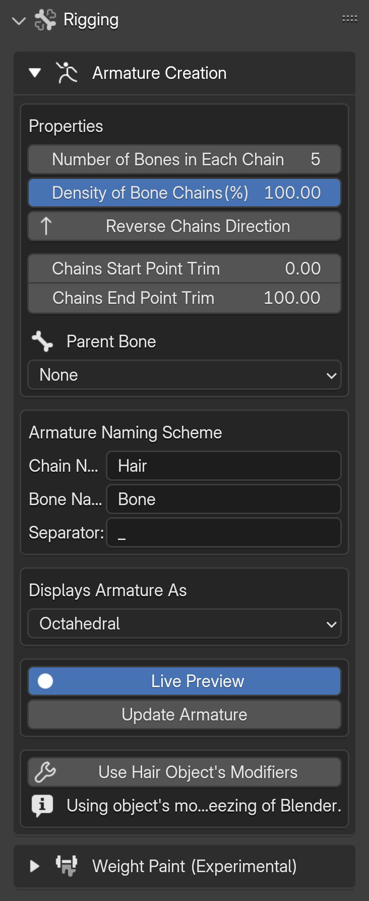{.responsive-img}

## Parent Bone

As mentioned earlier, there are two options for setting the parent bone:

**Option 1:** Creating a New Parent Bone

This option involves creating an additional parent bone located at the origin point of the hair object and assigning all the bone chains as children to it.

To proceed:

- Select the "Add Parent Bone to Armature" option.

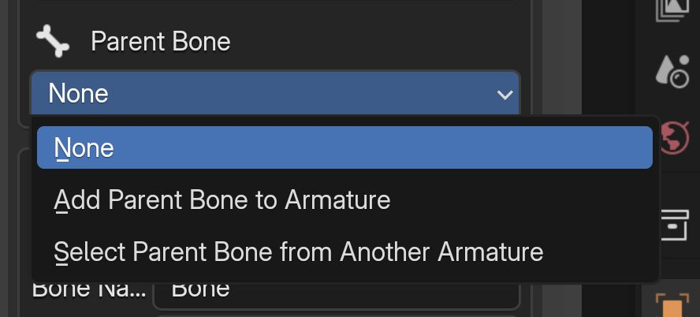{.responsive-img}

- Once this option is chosen, a new parent bone will be added to the armature. You can then adjust the size and name of this parent bone to suit your needs.

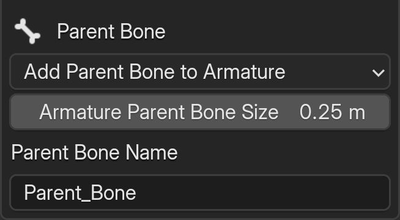{.responsive-img}

**Option 2:** Selecting a Bone from Another Armature

In this option, you can set a bone from a different armature as the parent bone.

To do proceed:

- Choose the "Select Parent Bone from Another Armature" option.
- Then you'll be presented with an option to select the parent armature.

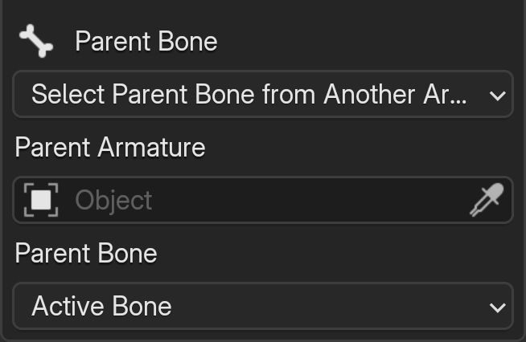{.responsive-img}

- After selecting the armature, a list of bones from that armature will be available, allowing you to select the desired parent bone. By default, the active bone from the selected armature will be set as the parent bone unless you choose a different one.

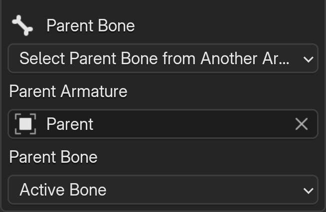{.responsive-img}

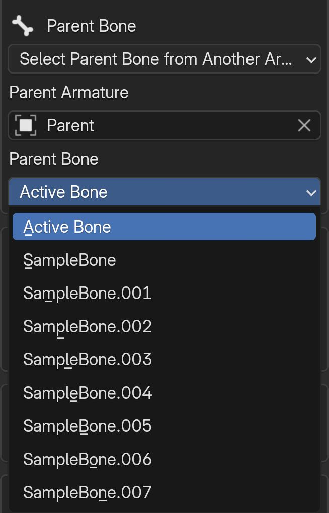{.responsive-img}

## Armature Display

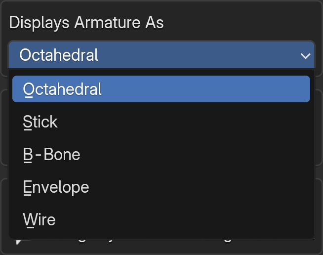{.responsive-img}

As mentioned earlier, there are four options for displaying the armature, below you can see how each option looks like.

---

- Octahedral

---

- Stick

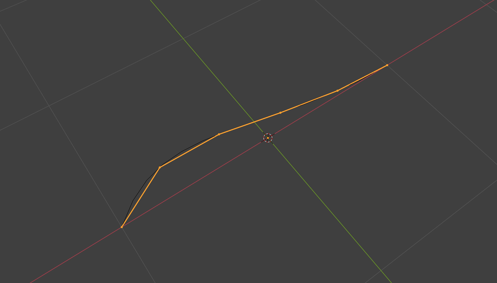

---

- B-bone

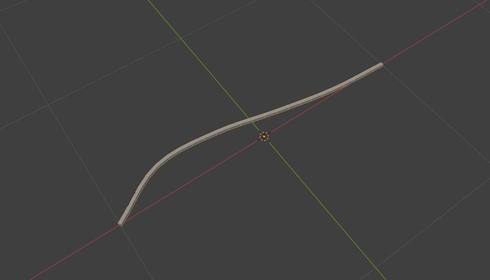

---

- Envelope

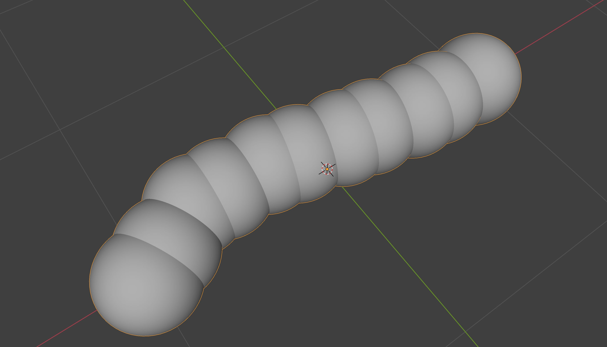

---

- Wire

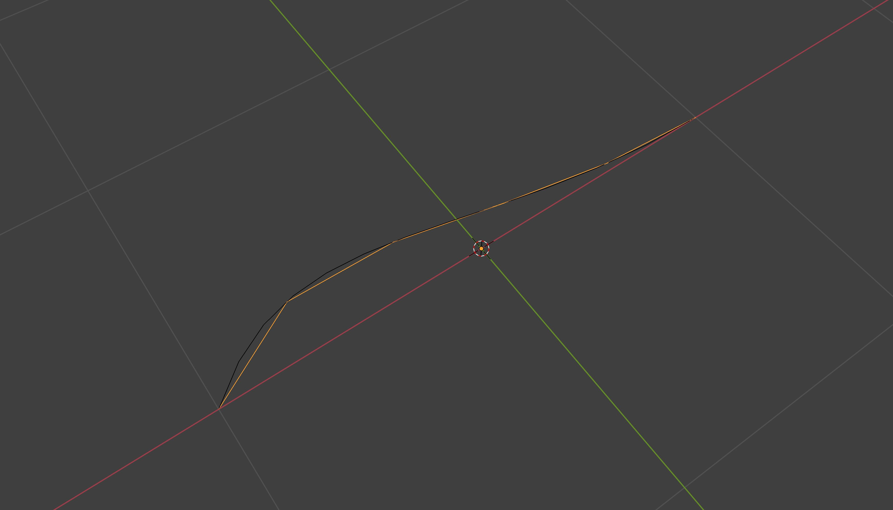

---

### B-bone options:

**Options:**

- Segments: The number of segments each bone is split into.
- Display X Width: The width of the X-axis of the bone shown in the viewport.
- Display Y Width: The width of the Y-axis of the bone shown in the viewport.

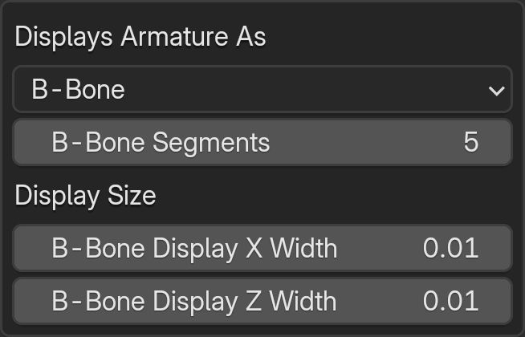{.responsive-img}

---