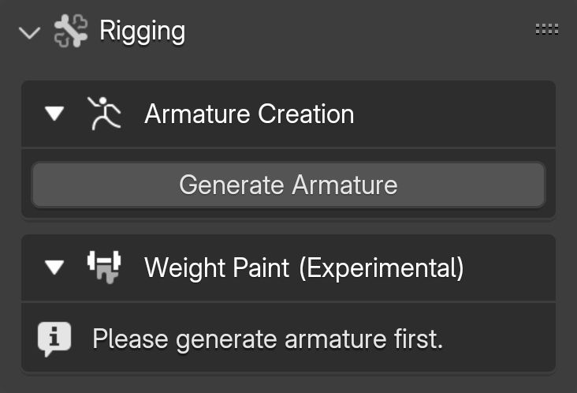
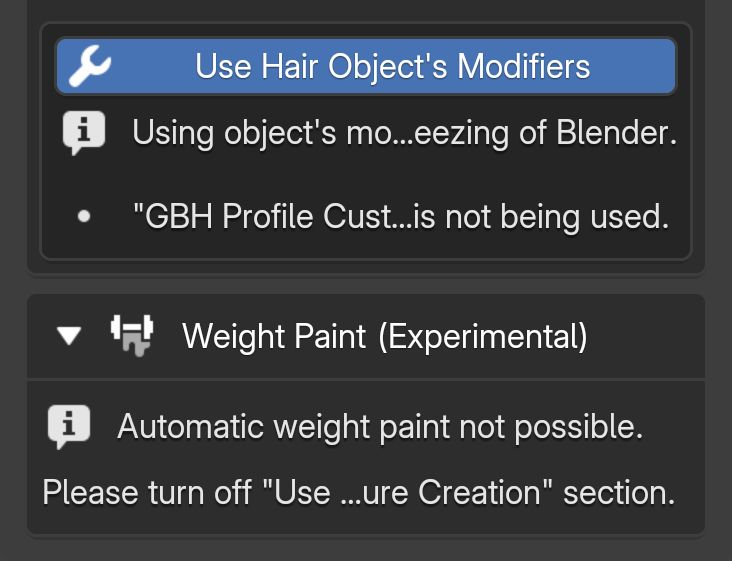
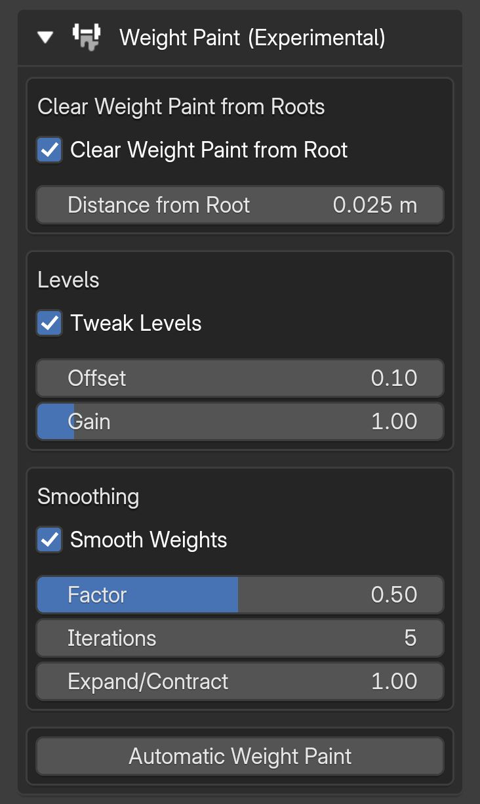

# Automatic Weight Paint

This feature is currently in the experimental stage, so please back up your files before proceeding.

To use this feature, ensure the following two conditions are met:

1. The hair armature must be created using the add-on.
2. The "Use Hair Object's Modifiers" option must be disabled during the armature creation process.

{.responsive-img}

{.responsive-img}

---

**Options:**

- Clear Weight Paint From Roots: Removes all weight paint from the hair roots within the selected distance from the root.
- Levels: Adds an offset and a scale to all weights, allowing you to raise or lower the overall “heat” of the weights.
- Smooth: Blends the weights of selected vertices with adjacent unselected vertices.

{.responsive-img}

---